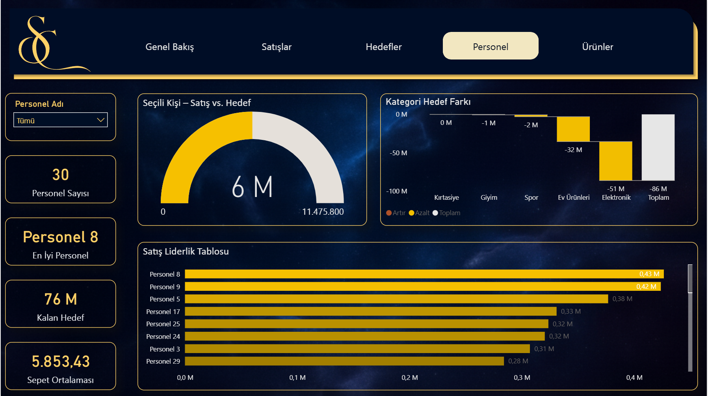

# Satış, Hedef, Personel ve Ürün Haritası — Görsel Galeri

Power BI ile geliştirilmiş, satış, hedef, personel ve ürün performansını tek bakışta sunan yönetim dashboard’u.  
Sayfalar: **Genel Bakış, Satışlar, Hedefler, Personel, Ürünler.**

---

## Galeri

### 1) Overview — Genel Bakış
Şirketin genel durumunu, satış ve hedef gerçekleşmelerini tek ekranda gösterir.

### 2) Sales — Satışlar
Aylık bazda satış performansını ve kategori bazlı dağılımları özetler.

### 3) Targets — Hedefler
Kategori ve personel bazında hedef farklarını, kalan potansiyeli görselleştirir.

### 4) Personnel — Personel Performansı
Satış ekibinin performansını ve liderlik tablosunu gösterir.

### 5) Products — Ürünler
Stok, satış ve kategori ilişkilerini tek ekranda birleştirir.

---

📅 **Oluşturma tarihi:** 2025-11-03  
🧭 **Amaç:** Veriyi sade, anlaşılır ve eyleme dönüştürülebilir biçimde sunmak.

